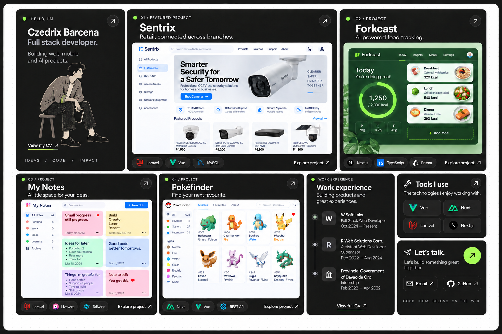
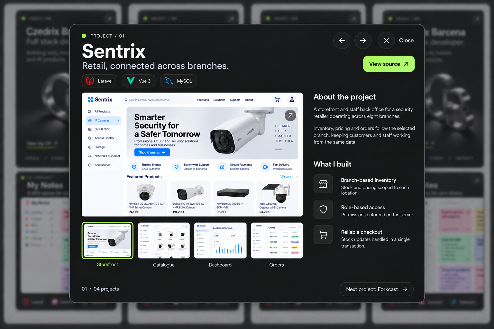

# Portfolio redesign implementation plan

Status: design approved; implementation not started.
Date: 2026-09-12

## Objective

Build a desktop-first, project-focused portfolio using the attached dark bento layout. Keep the introduction, projects, experience, technologies, CV, and contact on the homepage. Project details open in a centered tray with smooth, restrained iOS-inspired motion. The large project screenshot can open in a zoomable image viewer.

This document plans the work only. It does not authorize deployment or change the current website.

## Approved references

### Homepage

### Centered project tray

Use the first image as the authority for the homepage grid. The second image defines the tray; its blurred background is illustrative and must not replace or rearrange the actual homepage.

## 1. Visual direction and content

- Off-white dotted outer canvas; near-black rounded panels; fine borders; white headings; muted secondary text; restrained lime highlights.
- No top navbar or separate brand header. Navigation happens through project cards and explicit CV/contact actions.
- Keep the editorial seated character in the introduction: textured ink, natural proportions, muted tones, and a small lime detail. Avoid glossy 3D mascot styling.
- The character remains a static illustration for the first implementation. Motion belongs primarily to the interface; do not animate a flattened illustration as if it were a rigged character.
- Reuse actual project screenshots, descriptions, links, and technology stacks from `assets/data/projects.json`. Generated screenshots in the references are visual placeholders, not replacement product assets.
- Reuse `assets/data/experience.json` for employers, roles, and dates. Show concise entries in the experience tile, with the existing CV for full detail.
- Use verified contact links from the current site. Do not use invented addresses, availability claims, or metrics from mockups.
- Preserve existing SEO metadata and meaningful headings.

### Homepage composition

| Region | Content and priority |
| --- | --- |
| Top left | Introduction, editorial character, CV link |
| Top center | Sentrix, largest featured project preview |
| Top right | Forkcast project preview |
| Middle row | Arawan, Tindahan, and My Notes project previews |
| Bottom left-center | A regular experience tile with three roles; never a full-width strip |
| Bottom right | Technologies and contact tiles |

Use CSS Grid with explicit areas and content-aware row heights. Match the reference proportions rather than forcing every screen into a fixed screenshot height. Start with 8–12px gutters, 16–20px panel radii, and 24–32px outer padding, then refine against the reference. Text must stay readable without clipping job titles.

Desktop is the primary design target. At narrower widths, reorganize into two columns and then one column in a meaningful reading order. Allow natural page scrolling instead of shrinking text or forcing all panels into one viewport.

## 2. Panel entrance and loading treatment

### Selected entrance: a soft staggered reveal

Each panel fades from opacity 0 to 1 while moving upward 10px and scaling from 0.985 to 1. Use a 440ms ease-out with `cubic-bezier(0.22, 1, 0.36, 1)`. This small movement suits the compact grid and avoids dramatic flying cards or rubbery bouncing.

| Panel | Initial delay | Content reveal |
| --- | --- | --- |
| Introduction | 0ms | Bio and character appear together |
| Sentrix | 45ms | Panel shell and text together; image fades when decoded |
| Forkcast | 90ms | Same project image treatment |
| Arawan | 135ms | Same project image treatment |
| Tindahan | 180ms | Same project image treatment |
| My Notes | 225ms | Same project image treatment |
| Experience | 225ms | All roles appear together, without individual timeline animations |
| Technologies | 270ms | All chips appear together |
| Contact | 315ms | Actions appear with the panel |

The visible desktop entrance completes in about 755ms. For panels initially below the fold, reveal once when they enter view, using at most 90ms local stagger; do not retain a long page-wide delay. Do not replay entrances when closing a tray or switching screenshots.

### Actual image loading

- Reserve image dimensions/aspect ratios before loading so the grid never jumps.
- Use a quiet charcoal image placeholder, with a very subtle opacity pulse only while an image is actually pending. Avoid bright skeleton shimmer and spinners on every panel.
- When the image has decoded, crossfade it in over 180ms. Text and actions remain usable while images load.
- Do not add artificial delays or show a skeleton for already cached content.
- Load above-the-fold previews promptly; lazy-load lower images and gallery assets as appropriate. Preload the selected gallery image and its adjacent images when a project opens.
- On failure, show a stable unavailable-preview message and a retry action inside the reserved image area.
- Server-rendered content must remain visible if JavaScript fails. Entrance animation enhancement must not leave content stuck hidden after hydration or an interrupted transition.

## 3. Interaction motion specification

| Interaction | Motion | Target duration |
| --- | --- | --- |
| Project hover | Lift 2px; slightly brighten border and shadow | 160ms |
| Button hover | Subtle background/border change; arrow may move 2px | 140ms |
| Pointer press | Compress interactive surface to 0.985 | 100–120ms |
| Project opens | Tile visually expands into the centered tray; content resolves after expansion starts | 400–450ms |
| Backdrop opens | Fade dim layer in; crossfade a fixed soft blur layer | 220ms |
| Project closes | Reverse expansion toward the originating tile; backdrop fades out | 300–350ms |
| Gallery changes | Crossfade with at most 8px directional movement, inside a stable frame | 180–220ms |
| Next/previous project | Crossfade tray contents without moving the tray shell | 220ms |
| Image viewer opens | Selected screenshot expands into the centered viewer | 280–320ms |
| Zoom button/reset | Smooth transform toward target scale/position | 180–220ms |
| Direct image drag/pinch | Follow input directly; no easing delay | Immediate |

Use a critically damped spring feel with little or no overshoot. For a first implementation, use shared easing tokens and the Web Animations API/CSS transforms rather than adding an animation dependency by default. Keep durations configurable in one place.

Only actionable elements get hover/press treatment. Experience rows and static technology labels must not imply that they open something. Avoid continuous floating, parallax, pulsing status dots, and whole-page movement.

## 4. Centered project tray

- Open in the viewport center, horizontally and vertically, with balanced margins on all sides. It is not a side drawer.
- Use approximately `min(1200px, calc(100vw - 64px))` width and a maximum height of `calc(100dvh - 64px)` on desktop. Internal content can scroll when necessary; keep close controls reachable.
- Preserve the current homepage and scroll position behind a softly dimmed/blurred backdrop.
- Header: project name, concise subtitle, technology chips, appropriate source/live link, previous/next controls, and an obvious Close button.
- Body: large gallery on the left; project description and selected features on the right. On smaller screens, stack these within the same centered-dialog pattern.
- Gallery thumbnails update the large preview and clearly indicate selection. Counts come from the actual project data, including projects with only one image.
- Footer: current project number and next-project action. Use the displayed project order consistently: Sentrix, Forkcast, Arawan, Tindahan, My Notes.
- Closing restores focus to the triggering card and preserves page position. Changing projects keeps the shell still and resets that project's gallery to its first image.
- Capture the originating card rectangle for a transform-based expansion into the tray. Avoid scaling live text throughout the morph: transition a temporary visual shell, then crossfade the real tray content.
- On close, measure the origin again. If it is no longer visible or layout has changed, use a short centered fade/scale instead of flying toward stale coordinates.
- Rapid clicks, Escape during opening, resizing, and repeated open/close actions must cancel or finish transitions cleanly without duplicated overlays or stale scroll locks.

## 5. Zoomable large project image

The large screenshot is explicitly interactive: show a zoom-in cursor and a visible, labeled expand button. Clicking either opens a centered image viewer above the project tray.

### Viewer behavior

1. Start with the complete image fitted inside the viewport, preserving aspect ratio. Use the original high-resolution image, not a thumbnail.
2. Provide Zoom in, Zoom out, Reset/Fit, and Close buttons with accessible labels. Show the current zoom level.
3. Let users zoom from the fit baseline to 4× that baseline. Zoom buttons use controlled steps; double-click/tap toggles between fit and 2×.
4. Support wheel/trackpad zoom while the pointer is over the viewer and pinch zoom on touch devices. Zoom toward the pointer or gesture center.
5. Enable dragging/panning when the image exceeds the viewport. Clamp movement so the image cannot be lost outside the viewing area. Use grab/grabbing cursors.
6. Reset to fit when selecting a different image or reopening the viewer. Recalculate bounds on resize.
7. Closing the image viewer returns to the same selected screenshot in the still-open tray. Closing the tray afterward returns to the homepage.

Escape closes only the topmost layer: image viewer first, project tray second. Keep project controls inactive while zoom is open, retain the scroll lock until all overlays close, and restore focus to the large-image trigger. The viewer's controls must remain reachable at every zoom level.

## 6. Accessibility and performance

- Use semantic links/buttons, named dialogs, focus trapping, visible keyboard focus, and an inert background while overlays are open.
- Avoid nested interactive controls inside clickable cards. Give each project a clear primary opening button; any separate links remain separate controls.
- Provide descriptive image alt text and labeled thumbnail buttons with selection state.
- Support keyboard-only operation for project opening, project navigation, gallery selection, zoom controls, and closing both layers.
- Respect `prefers-reduced-motion`: remove translation, scale morphs, stagger, and loading pulses; use an immediate change or a short opacity fade of at most 120ms. Direct user-controlled zoom remains functional.
- Animate transforms and opacity primarily. Crossfade a fixed blur treatment instead of repeatedly animating expensive blur radii.
- Keep one source of truth for overlay state and stacked scroll locking. Clean up animations, event listeners, and temporary visual shells when unmounted or interrupted.
- Maintain contrast for small experience text and visible 44px touch targets for modal controls where possible.

## 7. Implementation sequence in the current Nuxt project

The project already has Nuxt/Vue, Tailwind, and Playwright configured. No application changes are part of this planning task.

1. Capture the current homepage and existing project modal as the before baseline before editing UI.
2. Prepare final assets: use original project screenshots; create/export a clean standalone editorial character asset matching the reference, with a transparent background. Do not crop a low-resolution character from the full mockup for production.
3. Rebuild `pages/index.vue` as the bento composition. Adapt the current hero, experience, project-card, and project-section components into the approved panel arrangement.
4. Update `layouts/default.vue` to remove the visible navbar and redundant footer from this composition, retaining a working skip link and main landmark.
5. Define colors, spacing, panel treatments, responsive rules, and motion tokens in `assets/css/main.css`. Retire conflicting AOS/legacy entrance effects on the redesigned components.
6. Adapt `components/ProjectDetailModal.vue` into the centered tray. Reuse the existing data and improve `composables/useScrollLock.js` for stacked overlays if necessary.
7. Add a focused image-viewer component and shared overlay/transition logic for gallery zoom, focus handling, and interruption-safe opening/closing.
8. Add the selected panel entrance/loading behavior, hover feedback, tray morph, and gallery transitions; verify reduced-motion behavior.
9. Run focused Playwright verification, capture before/after screenshots, and write the required Obsidian report before considering implementation complete.

## 8. Focused verification and acceptance criteria

Write/update Playwright tests for this redesign only. Extend the existing project-modal coverage where it remains applicable; do not run a broad unrelated regression suite.

- Homepage: expected panel arrangement, no navbar, five projects in showcase order, experience as its own regular tile, correct existing CV/contact destinations, and no overflow at desktop and narrow viewport sizes.
- Loading: delayed and failed image requests preserve layout; images resolve into their reserved frames; cached assets do not cause artificial delays.
- Tray: opens centered from each project, presents the correct data, supports thumbnail and project navigation, closes cleanly, restores focus/scroll, and survives rapid open/close interactions.
- Zoom: image click opens viewer; controls change scale; drag bounds hold; reset returns to fit; closing preserves selected gallery image. Verify Escape closes one layer at a time.
- Accessibility/motion: keyboard focus remains in the active layer; reduced-motion mode removes spatial entrance/morph effects; no panel remains hidden after entrance completion.
- Capture only the redesigned homepage, centered tray, and zoom viewer with `await page.screenshot(...)`. Compare the previous homepage and modal against the same new views; label zoom as a new state when no previous equivalent exists.
- Review motion in the browser or a short focused Playwright recording; still screenshots alone cannot prove smoothness. Avoid brittle assertions on exact animation frame times; verify settled geometry and final state instead.
- Run the production build after implementation in addition to the focused E2E checks. Resolve relevant failures before handoff.

### Required implementation report

Use the implementation date for `<YYYY-MM-DD>`:

- Report: `D:\Submit\Obsidian Vault\Reports\<YYYY-MM-DD>-portfolio-bento-redesign.md`
- Screenshots: `D:\Submit\Obsidian Vault\Reports\attachments\<YYYY-MM-DD>-portfolio-bento-redesign\`
- Include Summary, Test results with relevant output, a before/after screenshot table, and Notes.
- Embed screenshots using relative Markdown paths such as `./attachments/<YYYY-MM-DD>-portfolio-bento-redesign/homepage-after.png`.
- Obtain filesystem approval if the vault remains outside the writable workspace; do not redirect the required report to Downloads.

Completion means the implemented grid and centered tray match the approved direction, panel entrances feel restrained and responsive, the large image can be inspected through accessible zoom/pan controls, and the focused tests and report are complete.
